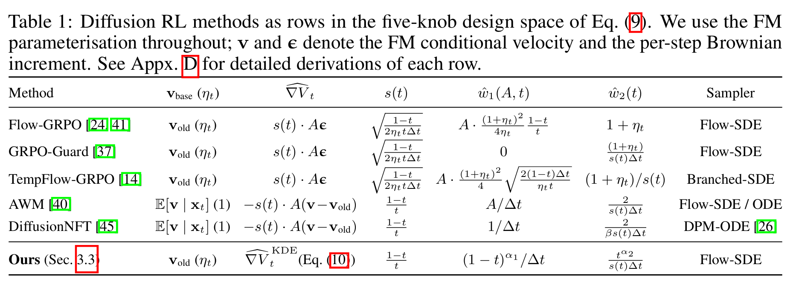

This is still a developing draft.

## 0. Foreword

This blog is largely inspired by [**Designing Reinforcement Learning for Diffusion Models: A Unified Path-Space View**](https://www.arxiv.org/pdf/2608.14430), which I might casually abbreviate to '0814' later. I would say it led me to actively exploring the field of Diffusion RL.

> Why write this blog?

I was amazed by [**DiffusionNFT**](https://arxiv.org/abs/2509.16117) for its clean formulation and how a policy is dragged linearly towards a preferred distribution in its training process. However as I search for surveys on RL for post-training diffusion models, most papers I get are either [outdated surveys](https://arxiv.org/abs/2311.01223) not covering these methods, or surveys about how DM plays a role in RL - not at all relevant to my curiousity. Why can one diffusion RL algorithm look like REINFORCE on an SDE trajectory, while another looks like supervised regression on analytically noised endpoints and both are called *'RL'*? And that's why 0814 felt so inspiring - it answers that question gracefully, placing recent methods together in one paper and providing an insightful explanation for viewing them. **In this blog I try to write down my thoughts while learning about 2608 and exploring neighboring methods not covered in this paper**. (Disclaimer: This is not a formal survey of any kind. I will only draw comparisons between methods that intrigued me.)

(09/26/26: Found one newer survey, updated Nov. 2025. [XueZeyue/Awesome-Visual-Generation-Alignment-Survey](https://github.com/XueZeyue/Awesome-Visual-Generation-Alignment-Survey).)

> Only a beginner. Errors are possible. I apologize for possible mistakes and welcome any form of comments / corrections / suggestions. 

## 1. Diffusion's curse and blessing
### 1.1 Structural obstacle of Diffusion RL

We know the canonical regularized RL objective:

$$
J(\theta) = \mathbb{E}_{P_\theta} [A] - \beta KL(P_\theta  ||  P_\text{ref}), \tag{1}
$$

where the advantage $A$ is determined solely by the terminal clean image $x_0$. Normally for PPO (in LLMs) we would like to estimate the likelihood $\nabla{\log{P_\theta(x_0)}}$, but **diffusion never provides such a convenience**. For a clean sample $x_0$ we have innumerable paths to reach it, namely calculating the marginal: $P_\theta(x_0) = \int{P_\theta(x_{[0:1]}) \mathcal{D}x_{[0:1]}}$. Over continuous paths that integral is intractable and therefore the endpoint score function $\nabla{\log{P_\theta(x_0)}}$ cannot be estimated reliably. 

### 1.2 General solution: path-space

We need to calculate $\mathbb{E}_{x_0 \sim P_\theta(x_0)}[R(x_0)]$ but that marginal distribution has been proven intractable. To solve this issue a nice observation would be: 
$$
\mathbb{E}_{p(x)} A(x) = \mathbb {E}_{p(x,z)} A(x) \tag{2}
$$
for whatever the latent variable $z$ is. Eq. 2 is useful for us because we know the trajectory distribution through the product of conditional probabilities. For convenience, I will present the discrete timestep version of the trajectory (and leave continuous notations later).
$$
P_\theta(\tau) = p_1(x_1) \prod_t p_\theta (x_{t-\Delta t}  \mid  x_t) \tag{3}
$$

where $\tau$ denotes the denoising trajectory. That observation alone already explains half of the Diffusion RL problem (peeled off the maths), I daresay. 

Now we can handle the RL problem with that product. We have trajectories collected from an older policy $Q$, but again, what we need to calculate $\mathbb{E}_{x_0 \sim P_\theta(x_0)}[R(x_0)]$ or in path-space view $\mathbb{E}_{\tau \sim P_\theta(\tau)}[A(x_0(\tau))]$, something sampled under $P_\theta$ not $Q$. Luckily, it's easy to derive:
$$
\mathbb{E}_{P_\theta(\tau)} A(x_0(\tau)) = \mathbb{E}_{Q(\tau)}{[\frac{P_\theta(\tau)}{Q(\tau)}A(x_0(\tau))]} = \mathbb{E}_{Q(\tau)} [\prod_t \frac{p_\theta (x_{t-\Delta t}  \mid  x_t)}{q(x_{t-\Delta t}  \mid  x_t)} A(x_0(\tau))] \tag{4}
$$
(The initial noise distribution $p_1(x_1)$ cancels out in $P_\theta$ and $Q$. **This is simply importance sampling and the direct source of Flow-GRPO's per step optimization.** But let's dive deeper with 0814 before returning to any specific method.)

And now it's time to replace the abstract $p$'s and $q$'s with continuous diffusion SDEs. Note that as $Q$ is an older version of the model, the stochasticity schedule stays fixed throughout the training as a selected implementation design before any training occurs at all. Thus we can assert that the diffusion coefficient $g$'s are the same for $P$ and $Q$. 

**(For convenience in discussing Ito calculus and avoiding $\mathrm{d}t<0$ problems, I follow the conventions of Appendix C of 0814, where $r := 1-t$ and $y_r = x_{1-t}$)** Recall the target form; under this $r$ convention it would be: 
$$\frac{p_\theta (y_{r+\Delta r}  \mid  y_r)}{q(y_{r+\Delta r}  \mid  y_r)}.$$ 

Schematically for $P$ and $Q$ **sampling**(i.e. reverse, i.e. $\mathrm{d}t < 0, \mathrm{d}r>0$) trajectories we have different drifts $\mu$ and shared diffusion $g$ (the forward and reverse SDEs share the same diffusion coefficient, and for simplicity $g_r := g_t$):

$$
P_\theta: \text{d}y_r = \mu_\theta(y_r, r) \text{d}r + g_r \text{d} W_r
$$
$$
Q: \text{d}y_r = \mu_q (y_r, r) \text{d}r + g_r \text{d} W_r. \tag{5}
$$

Now every discrete transition can be written as a tiny Gaussian.
$$
p_\theta(y_{r + \Delta r} \mid y_r) = \mathcal{N}(y_r + \mu_\theta\Delta r, g_r^2\Delta r)
$$
$$
q(y_{t + \Delta t} \mid y_r) = \mathcal{N}(y_r + \mu_q\Delta r, g_r^2\Delta r). \tag{6}
$$

Recall the trajectories we have now are **all sampled from $Q$**. So:
$$
y_{r+\Delta r} - y_r - \mu_q \Delta r = g_r \sqrt{\Delta r} \epsilon_r. \tag{7}
$$
Therefore,
$$
y_{r+\Delta r} - y_r - \mu_\theta \Delta r = g_r \sqrt{\Delta r} \epsilon_r - \Delta \mu(y_r, r)\Delta r. \tag{8}
$$

where $\Delta \mu := \mu_\theta - \mu_q$, simply how far is the current drift away from the older policy that collected those samples. With these identities (Eq. 6,7&8), now we obtain the desired form perfectly. 

$$
\begin{align}
\log \frac{p_\theta (y_{r+\Delta r}  \mid  y_r)}{q(y_{r+\Delta r}  \mid  y_r)} & = - \frac{1}{2g_r^2 \Delta r} ( || y_{r+\Delta r}-y_r-\mu_\theta \Delta r || ^2 -  || y_{r+\Delta r}-y_r-\mu_q \Delta r || ^2) \\
& =  - \frac{1}{2g_r^2 \Delta r} ( || g_r \sqrt{\Delta r} \epsilon_r - \Delta \mu \Delta r  || ^2 -  || g_r \sqrt{\Delta r} \epsilon_r || ^2) \\
& = \frac{\Delta \mu}{g_r}  \sqrt{\Delta r} \epsilon_r - \frac{1}{2}  || \frac{\Delta \mu}{g_r} || ^2 \Delta r. 
\end{align}
\tag{9}
$$ 

And this is the equation that perhaps supported the whole analysis of 0814. **A log policy ratio is simply linear drift-noise correlation** (Did my change in SDE drift align with the noises along that sampled trajectory?), **minus a quadratic energy drift cost** (How informative was $Q$? If it was too far it meant nothing.).

This log ratio itself is informative enough, but to respect the original form in 0814, it's not difficult to write out a(n) (informal) derivation. Recall Eq. 4. where we wrote (changed to the sampling path notation):
$$\prod_r \frac{p_\theta (y_{r+\Delta r}  \mid  y_r)}{q(y_{r+\Delta r}  \mid  y_r)}$$

From Eq. 9 we obtain:

$$
\begin{align}
\log \frac{P_\theta(\tau)}{Q(\tau)} &= \log \prod_r \frac{p_\theta (y_{r+\Delta r}  \mid  y_r)}{q(y_{r+\Delta r}  \mid  y_r)} \\
&= \sum_r \log \frac{p_\theta (y_{r+\Delta r}  \mid  y_r)}{q(y_{r+\Delta r}  \mid  y_r)}\\
&= \sum_r (\frac{\Delta \mu(y_r,r)}{g_r}  \sqrt{\Delta r} \epsilon_r - \frac{1}{2}  || \frac{\Delta \mu(y_r,r)}{g_r} || ^2 \Delta r) 
\end{align}\tag{10}
$$

By letting $\Delta r \rightarrow 0$ we (heuristically) turn that discrete sum into a continuous integral (standard brownian motion $\mathrm{d}W_r = \epsilon_r \sqrt{\Delta r}$):
$$
\log \frac{\mathrm{d} P_\theta}{\mathrm{d} Q} = \int_0^1 (\frac{\Delta \mu(y_r,r)}{g_r} \mathrm{d}W_r - \frac{1}{2}  || \frac{\Delta \mu(y_r,r)}{g_r} || ^2 \mathrm{d} r) \tag{11}
$$

And Eq.11 is the Girsanov Theorem the 0814 paper is using. The discrete version already tells what we need to know (linear minus quadratic); this is simply a nicer formulation (under regular conditions).
> (I took a slightly divergent path here because I am not at all familiar with Ito calculus and never heard of Radon-Nikodym derivatives before (forgive me) and I think it easier to understand the optimization geometry in discrete settings)

A quick recap: substituting this continuous-time notation ([R-N derivative](https://proofwiki.org/wiki/Definition:Radon-Nikodym_Derivative)) into Eq. 4 we obtain:

$$
\mathbb{E}_{P_\theta(\tau)} A(x_0(\tau)) = \mathbb{E}_{Q(\tau)} [\frac{\mathrm{d} P_\theta}{\mathrm{d} Q}(\tau) A(y_1(\tau))] \tag{12}
$$

Expanding the R-N derivative $\frac{\mathrm{d}P}{\mathrm{d}Q}$ and **keeping only the first order $\Delta \mu$ pertubation** (*and we will return to the second time in section 2*) yields (for notation convenience I will abbreviate $\mathbb{E}_{P_\theta(\tau)} A(x_0(\tau))$ to $J_{policy}$):

$$
\delta J_{policy}(\theta) = \mathbb{E}_Q[\int_0^1 \frac{\delta \mu_r}{g_r} \mathrm{d}W_r A(y_1)] \tag{13}
$$

This is REINFORCE in continuous time.

### 1.3 Turning terminal advantage to value function

But the thing is the advantage (or the reward) is a terminal value only determined by $y_1$ (or $x_0$ if you prefer) solely. A natural question that arises is whether the terminal advantage tells us that the Brownian movement at time $r$ (the $\mathrm{d}W_r$) is good or not?

To answer that question, it would be natural to calculate the expectation of the terminal advantage $A(y_1)$ under the condition $y_r$, i.e. the current state. We can thus define:
$$
V_r := \mathbb{E}_Q [A(y_1(\tau)) \mid y_r], 
$$
interpreted as the value of the current noisy middle state $y_r$. As a conditional expectation, this $V_r$ is **the best terminal advantage estimate we have**. And upon that since the process can be read as Markovian, the current state $y_r$ is a sufficient statistic (so taking the condition $y_r$ simply equals to taking the condition $\mathcal{F}_r$). In formal maths language (martingales and filters), for $r<s$ (and naturally $\mathcal{F}_r \subset \mathcal{F}_s$):
$$
\mathbb{E}_Q[V_s \mid \mathcal{F}_r] = \mathbb{E}_Q[\mathbb{E}_Q[A(y_1) \mid \mathcal{F}_s] \mid \mathcal{F}_r]
= \mathbb{E}_Q [A(y_1) \mid \mathcal{F}_r] = V_r \tag{14}
$$

by the tower property. This is simply the formal way of saying $V_r$ is **a martingale**. Its mean is not supposed to have a drift in any direction; in other words, expressed in an SDE, its drift term **must be 0**.

Meanwhile [Ito's Lemma](https://en.wikipedia.org/wiki/It%C3%B4%27s_lemma) tells us, with $V_r = V_r(y_r)$:
$$
\mathrm{d} V_r = (\partial_r V + \mu_Q^\top \partial_{y} V_r + \frac{1}{2}g_r^2 \partial_{yy} V_r) \mathrm{d}r + g_r \nabla_{y_r} V_r^\top \mathrm{d}W_r. \tag{15} 
$$ 

Compounded with the fact that the drift term must be 0, we obtain:
$$
\mathrm{d} V_r = g_r \nabla V_r^\top \mathrm{d}W_r. \tag{16} 
$$ 

From Eq. 16, we can write out the terminal advantage in another way:
$$
A(y_1) = V_1 = V_0 + \int_0^1  g_r \nabla V_r^\top \mathrm{d}W_r \tag{17}
$$

And substituting Eq. 17 into Eq. 13 yields (remember in Ito calculus we have (informally) $(\mathrm{d}W)^2 = \mathrm{d}t$, formally known as Ito isometry):

$$
\begin{align}
\delta J_{policy}(\theta) & = \mathbb{E}_Q[\int_0^1 \frac{\delta \mu_r}{g_r} \mathrm{d}W_r (V_0 + \int_0^1  g_r \nabla V_r^\top \mathrm{d}W_r)] \\
& = \mathbb{E}_Q [\int_0^1\frac{\delta \mu_r}{g_r} \mathrm{d}W_r \cdot \int_0^1  g_r \nabla V_r^\top \mathrm{d}W_r] + V_0 \cdot \mathbb{E}_Q [\int_0^1 \frac{\delta \mu_r}{g_r} \mathrm{d}W_r] \\
& = \mathbb{E}_Q [\int_0^1\nabla V_r ^ \top \delta \mu_r \mathrm{d} r] + 0.
\end{align}
\tag{18}
$$

In other words, combined with Eq. 13,
$$
\mathbb{E}_Q[\int_0^1 \frac{\delta \mu_r}{g_r} \mathrm{d}W_r A(y_1)] =
\delta J_{policy}(\theta) = \mathbb{E}_Q [\int_0^1\nabla V_r ^ \top \delta \mu_r \mathrm{d} r]

\tag{19}
$$

**We have proved that rewarding all the random Brownian movements along a good trajectory is (in expectation and first order to $\Delta \mu$) the same to moving the drift directly in the direction that increases expected terminal advantage.** The central amount we care about is now $\nabla V_r$.

### 1.4 Estimating the value gradient

The problem is not over yet. $\nabla V_r$ is still a hanging notation central to the RL problem. We have to **estimate** it.

One straightforward (and generic) way would be using Eq. 16: $\mathrm{d} V_r = g_r \nabla V_r^\top \mathrm{d}W_r.$ Over a small time interval $\Delta r$ we get $\Delta V_r = g_r \nabla V_r^\top \Delta W_r$, and then multiplying $\Delta W_r$ and taking a conditional expectation on both sides we get:
$$
\mathbb{E}[\Delta V_r \Delta W_r  \mid  \mathcal{F}_r] = g_r \nabla V ^ \top (\Delta W)^2 = g_r \nabla V ^ \top \Delta r \tag{20}
$$
And we observe that only the part of the terminal advantage that became predictable through this Brownian kick survives its covariance with $\Delta W_r$, since all the advantage the Brownian motion at other timesteps 'created' have zero conditional mean here.
$$
\mathbb{E}[A(y_1) \Delta W_r  \mid  \mathcal{F}_r] = \mathbb{E}[\Delta V_r \Delta W_r  \mid  \mathcal{F}_r] = g_r \nabla V ^ \top \Delta r \tag{21}
$$

Replace the expectation with an one-sample estimate and  we have an $\nabla V$ estimator, which the 0814 named as 'the stochastic estimator' because it contains the Brownian motion term $\Delta W$:
$$
\widehat{\nabla V}^\text{sto} = \frac {A(y_1) \Delta W_r}{g_r \Delta r} = \frac {A(y_1) \epsilon_r}{g_r \sqrt{\Delta r}} \tag{22}
$$

This is the general method that applies even when the stochastic dynamics is completely a black box. The general idea is simply change $x_t$ a bit, observe the terminal reward, and infer the gradient. But of course this is not the best estimate: the sampled noises are $O(1)$ yet the useful correlation is only $O(\sqrt{\Delta r})$. Dividing the noise by a small $\sqrt{\Delta r}$ significantly amplifies the variance,  i.e. $\text{Var}(\widehat{\nabla V}^\text{sto}) \sim O(\frac{1}{\Delta r})$.

And I think the following part (represented by the idea of NFT) is the real genius. We have been asking which Brownian movement turns out to lead to a great endpoint (which we said is a generic method); but diffusion provides a great convenience here. We know how $x_t$ is corrupted from $x_0$, in other words, $x_0$ exerts an analytic "pull" for the given noised state $x_t$. 'What makes a **good $x_t$, a noised middle state that is more compatible to those high-reward clean images?**'.

Recall the definition of $V_t = \mathbb{E}_Q [A(x_0) \mid x_t].$ Expanding this into integral form yields:
$$
V_t = \int A(x_0) q(x_0 \mid x_t) \mathrm{d}x_0 \tag{23}
$$

**and therefore the gradient:**
$$
\begin{align}
\nabla_{x_t}V_t &= \int A(x_0) q(x_0 \mid x_t) \nabla \log q(x_0 \mid x_t) \mathrm{d}x_0 \\
&= \mathbb{E}_Q[A(x_0)\nabla_{x_t} \log q(x_0 \mid x_t)  \mid  x_t] \\
&= \mathbb{E}_Q[A(x_0)\nabla_{x_t} (\log q(x_t \mid x_0) - \log q_t(x_t)) \mid  x_t] \\
&= \mathbb{E}_Q[A(x_0)\nabla_{x_t} \log q(x_t \mid x_0) \mid  x_t] - \mathbb{E}_Q[ \nabla_{x_t} \log q_t(x_t) \cdot A(x_0) \mid  x_t]\\
&= \mathbb{E}_Q[A(x_0)\nabla_{x_t} \log q(x_t \mid x_0) \mid  x_t] - V_t \nabla_{x_t}\log q_t(x_t)  \end{align} \tag{24}
$$
Using the mixture-score identity:
$$
\nabla_{x_t} \log q_t(x_t) = \mathbb{E} [\nabla_{x_t} \log q(x_t \mid x_0)  \mid  x_t]. \tag{25}
$$
we can obtain:
$$
\nabla_{x_t} V_t = \mathbb{E}[(A(x_0)-V_t) \nabla_{x_t} \log q(x_t \mid x_0) \mid x_t], \tag{26}
$$
which is essentially a conditional covariance between advantage and **the likelihood term measuring how compatible the noised image $x_t$ is with high-reward $x_0$ 's.** (Note the analogy with Eq. 21, which is discussing the covariance between *the advantage and a specific Brownian noise*.)

> Observation: Why don't we usually think this way as in Eq. 23 and 24? My understanding is that for a random RL setting we know nothing about the posterior $q(x_0|x_t)$. Diffusion does not give us the normalized posterior either, but gives us something almost as useful: an analytic derivative of the likelihood of every clean endpoint under the forward process. Bayes can then convert this into a derivative of posterior responsibility.

Returning to Eq. 26, for a rectified flow $x_t = (1-t)x_0 + t\epsilon$, $\log q(x_t \mid x_0)$ is analytical:
$$
\nabla \log q(x_t \mid x_0) = -\frac{x_t - (1-t)x_0}{t^2} \tag{27}
$$

With the definition of velocity $v = \frac{x_t-x_0}{t}$, Eq. 27 could be written as:
$$
\nabla \log q(x_t \mid x_0) = -\frac{x_t + (1-t)v}{t} \tag{28}
$$
Reusing Eq. 25 (mixture-score identity) yields:
$$
\nabla_{x_t} \log q_t(x_t) = \mathbb{E} [\nabla_{x_t} \log q(x_t \mid x_0)  \mid  x_t] = -\frac{x_t + (1-t)\mathbb{E}_Q[v \mid x_t]}{t} \tag{29}
$$
Here $\mathbb{E}_Q[v \mid x_t]$ refers to the average velocity of the proposal policy (that collected those training trajectories) given noise image $x_t$, which 0814 abbreviates to $v_\text{base}$.

Substituting Eq. 28 and Eq. 29 into Eq. 24 gives:
$$
\nabla V_t = - \frac{1-t}{t} \mathbb{E}_Q [A(x_0)(v-v_\text{base}) \mid x_t]
\tag{30}
$$

Thus a one sample estimator, named as the deterministic estimator by 0814 as it contains no local reverse-SDE Brownian-motion terms($\mathrm{d}W_t / \sqrt{\Delta t}$), looks like this
$$
\widehat{\nabla V}^\text{det} = - \frac{1-t}{t} A(x_0)(v-v_\text{old}) 
\tag{31}
$$
where $v_\text{base}$ is replaced by $v_\text{old}$ because the proposal policy $Q$ is usually an older version of the model in training, making $v_\text{old}$ a good approximation to $v_\text{base}$.

**To sum up, 0814 identified two different value gradient estimators.** The stochastic estimator identifies which Brownian kick in the sampling process created the good image, while the deterministic estimator pulls the model velocity directly to align with the those that generated great endpoints. 
$$
\boxed{\widehat{\nabla V}^\text{sto} = \frac{A(x_0) \epsilon_r}{g_r \sqrt{\Delta r}}}.
$$
$$
\boxed{
  \widehat{\nabla V}^\text{det} = - \frac{1-t}{t} A(x_0)(v-v_\text{old})
}
$$

### 1.5 Estimators to algorithms: Flow-GRPO and AWM

We have so far deliberately stayed at the level of an **infinitesimal policy perturbation**. From Eq. 19, of the drift is parameterized by $\theta$,

$$
\delta\mu_r = \nabla_\theta\mu_\theta(y_r,r)\,\delta\theta,
$$

then

$$
\nabla_\theta J_{\mathrm{policy}} =
\mathbb E_Q
[\int_0^1 (\nabla_\theta\mu_\theta)^\top \nabla V_r\,dr].
\tag{32}
$$

So estimating $\nabla V$ is translated from the geometry (SDE drift) to practical parameter updates. This gives us a clean way to read existing diffusion-RL algorithms. Under the first-order approximation, the question is essentially: **Which estimator of $\nabla V$ does the algorithm implicitly use?**

(For simplicity I will ignore the finite-step effects of clipping and KL regularization for the time being)

#### [Flow-GRPO](https://arxiv.org/abs/2505.05470): stochastic estimator

Flow-GRPO starts from the most direct RL interpretation of the denoising trajectory. A state is $(c,t,x_t)$, an action is the next denoised state $x_{t-\Delta t}$.(Introducing the $y_r = x_t, r=1-t$ notation once more.) Ignoring clipping for the moment, its policy ratio is

$$
\rho_r(\theta)
=
\frac{
p_\theta(y_{r+\Delta r}\mid y_r)
}{
p_{\mathrm{old}}(y_{r+\Delta r}\mid y_r)
}.
\tag{33}
$$

This is exactly the Gaussian transition we already used in deriving Girsanov (Eq. 4). At the rollout policy $\theta=\theta_{\mathrm{old}}$,

$$
y_{r+\Delta r}
=
y_r+\mu_{\mathrm{old}}\Delta r
+
g_r\sqrt{\Delta r}\,\epsilon_r.
$$

Taking the score of this Gaussian gives

$$
\begin{aligned}
\nabla_\theta
\log
p_\theta(y_{r+\Delta r}\mid y_r)
\big|_{\theta=\theta_{\mathrm{old}}}
&=
(\nabla_\theta\mu_{\mathrm{old}})^\top
\frac{
y_{r+\Delta r}-y_r-\mu_{\mathrm{old}}\Delta r
}{
g_r^2
}
\\
&=
(\nabla_\theta\mu_{\mathrm{old}})^\top
\frac{\sqrt{\Delta r}}{g_r}\epsilon_r.
\end{aligned}
\tag{34}
$$

Multiplying by the terminal advantage $A$,

$$
A(y_1)
\nabla_\theta\log p_{\mathrm{old}} =
\Delta r
(\nabla_\theta\mu_{\mathrm{old}})^\top
\boxed{
\frac{A(y_1)\epsilon_r}
{g_r\sqrt{\Delta r}}}
\tag{35}
$$

And we recognize the boxed term as the stochastic value gradient estimator from Eq. 22.

**So, to first order around the rollout policy, Flow-GRPO can be read as a discrete implementation of the stochastic value-gradient estimator.**

And once more, using the stochastic estimator creates a high-variance issue. Flow-GRPO asks every random Brownian kick along a successful trajectory:

*Were you one of the reasons this image eventually became good?*

Only the tiny reward-correlated component survives in expectation; the unrelated components cancel after averaging many trajectories.

> The actual Flow-GRPO algorithm of course contains more than Eq. 36: it uses clipped ratios, a reference-model KL penalty, denoising reduction etc. Yet they are not needed to understand which of our two first-order value-gradient estimators it is using. In addition [Dance-GRPO](https://arxiv.org/abs/2505.07818) also shares substantial resemblance with Flow-GRPO and can be explained in the same way. For more variations of Diffusion GRPOs please refer to the [Diffusion GRPO survey](https://arxiv.org/abs/2603.06623).

#### [AWM](https://arxiv.org/abs/2509.25050): Endpoint as action

AWM is still GRPO in some sense, but instead of regarding every $x_{t-\Delta t}$ as an RL action, it treats the entire generated clean image as the sequence-level action:
$
x_0\sim\pi_{\mathrm{old}}(x_0\mid c),
$
and the sequence-level GRPO objective is written as

$$
J_{\mathrm{GRPO}}
=
\mathbb E
[
\frac{\pi_\theta(x_0\mid c)}
{\pi_{\mathrm{old}}(x_0\mid c)}
A(x_0,c)
]
-
\beta D_{\mathrm{KL}}
(\pi_\theta\|\pi_{\mathrm{ref}}).
\tag{36}
$$

(and we still ignore that KL regularizer for the time being.) The problem, of course, is exactly where this blog began: $\pi_\theta(x_0\mid c)$ is not tractable, and AWM therefore replaces its log likelihood with **an ELBO surrogate**,

$$
\log\hat\pi_\theta(x_0\mid c)
=
-\mathbb E_{t,\epsilon}
[w(t)||v_\theta(x_t,t,c)-(\epsilon-x_0)||^2]
+\text{const}.
\tag{37}
$$

The theoretical ELBO weight for a rectified flow is $w_{\mathrm{ELBO}}(t)=\frac{1-t}{t},$ although AWM claims that simpler alternatives such as $1$ or $t$ can work better empirically.

(Ignoring the KL term), the first variation of the loss is 
$$
\delta J_{\mathrm{AWM}}
= A(x_0) \delta \log \hat\pi_\theta(x_0)
\tag{38}
$$

At $\theta=\theta_{\mathrm{old}}$ (the $\epsilon-x_0$ in Eq. 37 is simply $v$), 
$$
\begin{align}
\delta \log \hat\pi_\theta(x_0) 
&= -\delta \mathbb E_t
[w(t)||v_\theta(x_t,t,c)-(\epsilon-x_0)||^2] \\
&= -2 \mathbb E_t [w(t)(v_\mathrm{old} - v)^\top \delta v_\theta]
\end{align}
\tag{39}
$$ 
Therefore we obtain from Eq. 38 and 39 the first variation of the loss:
$$
\delta J_{\mathrm{AWM}}
=
2\mathbb E
\left[
A(x_0)\,w(t)
(v-v_{\mathrm{old}})^\top
\delta v_\theta
\right].
\tag{40}
$$

Now compare this with our deterministic value-gradient estimator (Eq. 31):

$$
\widehat{\nabla V}^{\mathrm{det}}
=
-\frac{1-t}{t}
A(x_0)(v-v_{\mathrm{old}}).
$$

And the same reward-times-velocity residual appears: $A(x_0)(v-v_{\mathrm{old}}).$

> In fact, if we consider *how* $\mu$ is given from $v$ using the flow-matching SDE,with the standard $\eta_t=1$ used in the 0814 derivation, switching from forward time $t$ to sampling time $r=1-t$ gives the reverse-drift perturbation (a more detailed explanation in )
>
> $$\delta\mu_r=-(1+\eta_t)\delta v_\theta = -2\delta v_\theta. \tag{41}$$
>
> Substituting Eq. 31 into Eq. 19 therefore gives
>
> $$\begin{aligned}\delta J_{\mathrm{policy}}
> &=\mathbb E\int[-\frac{1-t}{t}A(v-v_{\mathrm{old}})]^\top(-2\delta v_\theta)\,dt\\
> &=2\mathbb E\int\frac{1-t}{t}A(v-v_{\mathrm{old}})^\top\delta v_\theta\,dt.
> \end{aligned}\tag{42}$$
>
> If the ELBO weight satisfies $w(t)=(1-t)/t$, this is exactly the local variation in Eq. 42. In spirit, we can say AWM is an instance of the deterministic value gradient estimator. (Note a small discrepancy here with the empirical claim of $w(t)=1$ works well: we will explain it later in Section 2.)

---

We can therefore summarize the first-order story as

$$
\begin{array}{ccc}
\text{Flow-GRPO}
&
\longleftrightarrow
&
\displaystyle
\widehat{\nabla V}^{\mathrm{sto}}
=
\frac{A\epsilon_r}
{g_r\sqrt{\Delta r}}
\\[12pt]
\text{AWM}
&
\longleftrightarrow
&
\displaystyle
\widehat{\nabla V}^{\mathrm{det}}
=
-\frac{1-t}{t}
A(v-v_{\mathrm{old}})
\end{array}
$$

The first asks which **random reverse-process perturbation** (therefore written with $r$) happened to correlate with terminal reward. The second uses diffusion's known forward corruption kernel (therefore written with $t$) to ask which **endpoint-specific velocity residual** is associated with terminal reward.

They might look like very different algorithms because they target at different random variables during training. Under the first-order path-space analysis, however, both are ways of estimating the same local object $\nabla V$.

## 2. Beyond first order: the quadratic term

### 2.1 A term we ignored
We intentionally dropped something earlier. Everything in section 1 describes the **directional derivative at the proposal policy**. Real optimization takes finite steps away from that proposal. The Girsanov ratio (Eq. 11) already gave us two terms:

$$
\int \frac{\Delta \mu_r}{g_r} \mathrm{d}W_r
$$
tells us in which direction the policy should move
$$
-\frac12
\int
||
\frac{\Delta\mu_r}{g_r}
||^2dr.
$$
on the other hand, tells us how costly a finite displacement is. We deliberately ignored it when taking the first variation because it is second order in $\Delta\mu$. Time to bring it back.

> Note: This quadratic term lives within the Girsanov ratio! **It is not the additional KL regular term**! 

### 2.2 Expanding the Girsanov ratio, for diffusion.

> I have been avoiding the Flow Matching SDE in Section 1 because I wanted to keep most of the derivation to a general stochastic control case and make equations more interpretable. But here our question changes from 'in which direction' to the path displacement control, which is diffusion-specific. And here we have to write the SDE out.

A lazy way to write out the Flow Matching sampling (i.e. reverse) SDE would be (again $r=1-t$):
$$
\begin{align}
\mu_\theta(y_r,r) &= c_r(y_r) - (1+\eta_t)v_\theta(x_t,t), \\
g_t^2 &= \frac{2t\eta_t}{1-t}, \\
\mathrm d y_r &= \mu_\theta(y_r,r) \mathrm d r + g_r \mathrm d W_r, \qquad t=1-r,
\end{align}
\tag{43}
$$
where $c_r(y_r)$ denotes the term irrelevant to the velocity.

Therefore the policy change $\Delta \mu$ can be expressed as:
$$
\Delta \mu = \mu_\theta -\mu_\text{base} = - (1+\eta_t) (v_\theta - v_\text{base}) = -(1+\eta_t) \Delta v_\theta.
\tag{44}
$$
Under the standard $\eta_t =1$ schedule, we obtain $\Delta\mu = -2\Delta v$, which is essentially Eq. 41 explained.

Remember the Girsanov ratio looked like this:
$$
\log \frac{\mathrm{d} P_\theta}{\mathrm{d} Q} = \int_0^1 (\frac{\Delta \mu(y_r,r)}{g_r} \mathrm{d}W_r - \frac{1}{2}  || \frac{\Delta \mu(y_r,r)}{g_r} || ^2 \mathrm{d} r) \tag{11}
$$

> ... for simplicity $g_r := g_t$

Then using Eq. 43 we can expand the two terms of Eq. 11:

$$
\frac{\Delta \mu}{g_r} = - \frac{(1+\eta_t) \sqrt{1-t}\Delta v}{\sqrt{2t\eta_t}} = -\sqrt{\frac{(1+\eta_t)^2(1-t)}{2t\eta_t}}\Delta v_\theta \tag{45}
$$
$$
- \frac12  || \frac{\Delta \mu(y_r,r)}{g_r} || ^2 = - \frac{(1+\eta_t)^2(1-t)}{4t\eta_t} ||{\Delta v_\theta}||^2 \tag{46}
$$

Abbreviate $\frac{(1+\eta_t)^2(1-t)}{4t\eta_t}$ to $\tilde{w_t}$ we obtain another way of writing Girsanov ratio under the FM SDE, making velocity, which is the central topic in model training, an explicit variable in the equation (Equation 10 in 0814):

$$
\log \frac{\mathrm{d} P_\theta}{\mathrm{d} Q} = -\int_0^1 \sqrt{2\tilde w_{1-r}} \Delta v_\theta(x_{1-r},1-r)^\top \mathrm{d}W_r - \int_0^1 \tilde w_{1-r} ||\Delta v_\theta(x_{1-r},1-r)||^2 \mathrm{d}r \tag{47}
$$

also named $M_1(\theta)$ in 0814. Recall Eq. 12 where we connected this ratio (R-N derivative) to the objective we truly care about.
$$
J_\mathrm{policy} = \mathbb{E}_{P_\theta(\tau)} A(x_0) = \mathbb{E}_{Q(\tau)} [\frac{\mathrm{d} P_\theta}{\mathrm{d} Q}(\tau) A(x_0)]  = \mathbb{E}_{Q(\tau)} [\exp{(M_1(\theta))} A(x_0)]\tag{12}
$$

> Warning: Nonstandard/messy notation in the following subsections.

To obtain a more tractable local form, replace $\exp(M_1)$ by $1+M_1$ and drop the $\theta$-independent term $-\mathbb E_Q[A]$. Write the resulting loss to as  $\mathcal S_{\mathrm{policy}}$ (to minimize):
$$
\mathcal S_\mathrm{policy}(\theta) := -\mathbb E_Q[A M_1(\theta)]
= \mathbb E_Q \left[A \int_0^1 \sqrt{2 \tilde w_{1-r}} \Delta v_\theta^\top \mathrm d W_r + A \int_0^1 \tilde w_{1-r} ||\Delta v_\theta||^2 \mathrm d r\right]
\tag{48}
$$

This surrogate has the same first derivative as $-J_{\mathrm{policy}}$ at $\Delta v_\theta=0$. Away from the proposal, its gradient approximates the policy gradient by replacing the importance factor $\exp(M_1)$ with $1$, as in the local approximation of [0814, Proposition 1](https://arxiv.org/html/2608.14430#S3.SS1). 

As in Eq. 18 the stochastic term in this loss turns into $-\mathbb E_Q\int_0^1\nabla V_r^\top\Delta\mu_r\,\mathrm d r$. Using Eq. 44 and changing variables in the resulting ordinary integral gives
$$
\begin{align}
\mathcal S_\mathrm{policy}(\theta)
&= \mathbb E_Q \int_0^1 [(1+\eta_t) \nabla V ^\top\Delta v_\theta + A \tilde w_t ||\Delta v_\theta||^2] \mathrm d t.
\end{align}
\tag{49}
$$

**Two terms emerge: the linear term supplies a local improvement direction, and the quadratic term records finite displacement from the proposal in units of the sampler's noise.** 0814 calls these the 'on-policy' and 'off-policy' terms respectively.

### 2.3 Complete framework
And here is, in my point of view, the main contribution of 0814 - a major abstraction from the Girsanov-style objective in Eq. 49. **They identify that many RL algorithms share a similar formulation of**
$$
- L = \mathbb E \int_0^1 [\hat w_2(\eta_t,t) \widehat{\nabla V} ^\top \Delta v_\theta + 
\hat w_1(A,t) ||\Delta v_\theta||^2]\,\mathrm d t
\tag{50}
$$ 
The $-L$ is a loss to minimize. The form we get from Girsanov (Eq. 49) is one instance with $\hat w_2 = 1+\eta_t$ and $\hat w_1 =A \tilde w_t = \frac{(1+\eta_t)^2(1-t)A}{4t\eta_t}$.

> And here's one question that actually puzzled me for quite a while. Why relax weights that came from a derivation?
>
> My understanding is that what works for an expectation is not necessarily great for an one-sample estimate. Let $K_\theta(x_t,t)=\partial v_\theta(x_t,t)/\partial\theta$. With the proposal, advantage and value-gradient estimate held fixed during an update, a timestep bin of width $\Delta t$ contributes
> $$
> K_\theta^\top
> [
> \hat w_2(t)\widehat{\nabla V}_t
> +2\hat w_1(A,t)\Delta v_\theta
> ]\Delta t
> 
> $$
> to the parameter gradient. The quantities that matter are therefore the weights *multiplied by the estimator and the integration weight*, followed by the network Jacobian. A well-defined expectation can also have a bad Monte Carlo estimate.
> For example, with $\eta_t=1$, write $d=v-v_{\mathrm{old}}$. Substituting $\widehat{\nabla V}^{\mathrm{det}}=- \frac {1-t} t Ad$ into Eq. 49 gives the sample integrand
>
>$$
> \frac {1-t} t A \left[\|\Delta v_\theta\|^2-2d^\top\Delta v_\theta\right].
> $$
> Both terms inherit the $1/t$, which grows infinitely large near $t=0$ (the clean endpoint). This can amplify sampling noise and concentrate training on small $t$.

Therefore the whole design space can be described as $(\eta_t (\text{the sampler}), v_\text{base}, \widehat{\nabla V_t}, \hat w_1, \hat w_2)$, and 0814 concludes quite a few methods, unified under this framework.

The columns are respectively:

- $\eta_t$ (or in general the sampler) which trajectory distribution supplies the states?
- $v_\text{base}$: what is defined as zero displacement? Usually the proposal model $v_\text{old}$. For the exact forward-estimator interpretation it is the conditional mean $\mathbb E[v\mid x_t,c]$, approximated by $v_\text{old}$ in AWM and NFT.
- $\widehat{\nabla V_t}$ how is the value gradient(in section 1) estimated?
- $\hat w_1$ What is the sign and strength of the quadratic displacement term?
- $\hat w_2$ How strongly is the improvement direction applied?

> And this unification also sheds light on the earlier AWM mystery.
> We noted around Eq. 37 and Eq. 42 that AWM observed better performance with a simple weighting of $w(t)=1$ rather than the ELBO coefficient $w(t) = \frac{1-t}t$.
>
> Consider the AWM loss and $s(t) = \frac {1-t} t$ , with the rollout distribution and $A$ fixed and the importance ratio approximated by one:
>
> $$
> \begin{aligned}
> \mathcal S_{\mathrm{AWM}}
> &=\mathbb E_{x_0,c,t,\epsilon}\left[A w(t)\|v_\theta-v\|^2\right]\\
> &=\mathbb E\left[A w(t)\|\Delta v_\theta\|^2
> -2A w(t)d^\top\Delta v_\theta\right]+C,
> \end{aligned}
> \tag{51}
> $$
>
> With $w(t)=s(t)$, these are exactly the two coefficients inherited from Eq. 49 at $\eta_t=1$. With $w(t)=1$ however, the explicit $1/t$ disappears from both terms.
>
> To compare with the table, define the effective bin coefficients $a_t=\hat w_1\Delta t$ and $b_t=\hat w_2\Delta t$. Taking $\widehat{\nabla V}^{\mathrm{det}}=-s(t)Ad$, Eq. 52 gives
>
> $$
> a_t=A w(t),\qquad b_t=\frac{2w(t)}{s(t)};
> \qquad
> w(t)=1\\
> \text{therefore}\quad \hat w_1=\frac{A}{\Delta t},\quad
> \hat w_2=\frac{2}{s(t)\Delta t}.
> \tag{52}
> $$
>
> , simply AWM entries in the table. 

### 2.4 NFT re-understood
The canonical NFT objective looks like regression. But we can expand its two branches to obtain a more familiar form.

Use $\rho\in[0,1]$ for NFT's normalized reward ($r$ in the original paper). Define $A_{\mathrm{NFT}}=2\rho-1\in[-1,1]$. Let $\beta>0$ be NFT's mixing parameter. (Notation bit messy here. Not to be confused with the hyperparam of KL penalty in Eq. 1.) The original objective is

$$
\begin{aligned}
\mathcal S_{\mathrm{NFT}}(\theta)
&=\mathbb E\left[
\rho\|v_\theta^+-v\|^2+(1-\rho)\|v_\theta^--v\|^2
\right],\\
v_\theta^+&=(1-\beta)v_{\mathrm{old}}+\beta v_\theta
=v_{\mathrm{old}}+\beta\Delta v_\theta,\\
v_\theta^-&=(1+\beta)v_{\mathrm{old}}-\beta v_\theta
=v_{\mathrm{old}}-\beta\Delta v_\theta.
\end{aligned}
\tag{53}
$$

Using the same $d=v-v_{\mathrm{old}}$ and $\Delta v_\theta=v_\theta-v_{\mathrm{old}}$ as above, expand the loss for one training example:

$$
\begin{aligned}
l_{\mathrm{NFT}}
&=\rho\|\beta\Delta v_\theta-d\|^2
+(1-\rho)\|-\beta\Delta v_\theta-d\|^2\\
&=\beta^2\|\Delta v_\theta\|^2
-2\beta A_{\mathrm{NFT}}d^\top\Delta v_\theta+\|d\|^2.
\end{aligned}
\tag{54}
$$

The two branches contribute the *same* quadratic coefficient, and opposite cross terms, whose net coefficient is $2\rho-1$. Dividing by the positive constant $\beta^2$ and dropping the $\theta$-independent constant gives the equivalent minimization problem

$$
\frac{\mathcal S_{\mathrm{NFT}}}{\beta^2}
=\mathbb E\left[
\|\Delta v_\theta\|^2
+\frac{2}{\beta s(t)}
\left(\widehat{\nabla V}^{\mathrm{det}}_{\mathrm{NFT}}\right)^\top
\Delta v_\theta
\right]+C,
\qquad
\widehat{\nabla V}^{\mathrm{det}}_{\mathrm{NFT}}
:=-s(t)A_{\mathrm{NFT}}d.
\tag{55}
$$

Thus, in the same bin convention as Eq. 52,

$$
\hat w_1=\frac{1}{\Delta t},\qquad
\hat w_2=\frac{2}{\beta s(t)\Delta t}.

\tag{56}
$$

To understand the effect of the positive quadratic, complete the square:

$$
l_{\mathrm{NFT}}
=\beta^2\left\|
\Delta v_\theta-\frac{A_{\mathrm{NFT}}}{\beta}d
\right\|^2
+(1-A_{\mathrm{NFT}}^2)\|d\|^2.
\tag{57}
$$

For a training example, the preferred displacement is therefore $A_{\mathrm{NFT}}d/\beta$: toward its conditional velocity when $A_{\mathrm{NFT}}>0$. The quadratic is **always positive**. The positive quadratic ensures the loss has curvature $2\beta^2$ with respect to the predicted velocity. Negative feedback sets a finite target instead of rewarding an arbitrarily large distance from $v$. (Compare this with AWM $\hat w_1=\frac{A}{\Delta t}$ (signed, follows $A$), NFT's quadratic term follows the concept of displacement energy cost more closely. This is why you don't see an additional KL in NFT while that regularizer is needed for AWM.)

## 3. Beyond PPO-style 
There are far more RL algorithms (usually older ones) that this framework does not discuss/cover. 

Interestingly reviewers of NFT on OpenReview also noted a similarity between KTO and NFT, and the authors responded that KTO could be seen as a special instance.

### 3.1 Diffusion DPO
(TBD)

(Here's the thing: DPO actually also uses the ELBO surrogate as in AWM, this actually makes me wonder *what kind of a role* ELBO plays in this unified framework and possibly how using the same surrogate makes two methods closer than initially imagined)

### 3.2 Diffusion KTO
(TBD)

(KTO is NFT wrapped in a Utility function. It's actually worth exploring HOW that utility function might be desirable or not, an obvious drawback would be that it ruined that clean finite target regression) 

### 3.3 Others? Not sure

(TBD)

(CaPO, which claims to inherit IPO)

### 3.4 Empirical analysis

I am actually thinking of a comparison between DPO KTO (CaPO/IPO) NFT and possibly more, an analogy to the huggingface blog in early 2024 that compared DPO KTO and IPO.

> Ends here.
---
OMG section 1 is way too long but I admit that's how I understand this whole thing bit by bit and I have little idea how to shorten that.

I think I will *not* be able to connect to RAM in this blog. It would be way too lengthy after filling in all these and I wonder if I should split this blog and make Section 3. an individual sequel. RAM could be a short learning note that follows.

OPSD is also listed here (ByteDance: FlowMimic and DiffusionOPSD(quite a controversial paper anyway)) because DiffusionOPSD seems to inherit some intuition from NFT, thinking about possible connection. Probably open up a new sequel sometime in the future, but not very near.

IGO is probably a sequel that will never come. I heard that from some really theortical blogs and was quite amazed at the way they view RL at a higher/different level. Yet due to its low popularity in RL analysis I will need to know further about the theory before I transform that into a blog. 

## Yet to be completed
- KTO
- DPO
- RAM's perspective
- OPD /OPSD probably
- under the perspective of Information Geometric Optimization (this is interesting but quite far from practical use)

