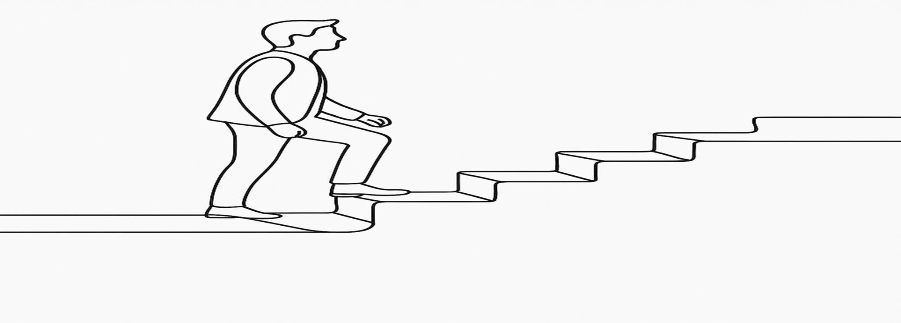

<!--  -->

## About Me

I am a Postdoctoral Fellow at TIFR-CAM, Bengaluru, working at the intersection of geophysical fluid dynamics and computational modeling. My research focuses on wave–vortex interactions using pseudo-spectral methods. I hold a Ph.D. in Mechanical Engineering from IIT Indore, where I specialized in heat transfer and bluff body flow control using computational fluid dynamics (CFD). My research explored natural, forced, and mixed convection in complex geometries, employing methods such as the finite volume and lattice Boltzmann approaches. 

My academic path spans doctoral and postdoctoral research, teaching, and technical mentoring. I have contributed to peer-reviewed journals, qualified the GATE exam multiple times, and participated in national and international workshops. I am working on high-performance scientific computing, including the parallelization of simulations using Python MPI. 

Creativity has always played a role in my work—from designing logos to building academic websites and contributing to science outreach. This page offers a glimpse; the full story brings together research, teaching, design, and discovery.

## Research Interests

- 
Geophysical fluid dynamics
 
- 
Wave-vortex interactions in the ocean

- 
Computational fluid dynamics

- 
Bluff body flows and flow control

- 
Nanofluid-based heat transfer

- 
Flow through porous media

- 
Thermal analysis of solar air heaters

<!-- - **Computer Vision:** image recognition, image generation, video captioning - **Machine Learning:** meta-learning, incremental learning, transfer learning -->

## Education

- **Ph.D.** (December 2014 - November 2021) IIT Indore, Madhya Presdesh, India.
- **M.Tech** (2009 - 2010) NIT Bhopal, Madhya Pradesh, India.

## Exprience

- **Post-Doc** (August 2022 - till date) TIFR-Centre for Applicable Mathematics, Karnataka, India.
- **Teaching** (2011 - 2014) 

<!-- - **Research Experience** (2022 - till date) 



<!--##  Lectures/Workshop/Training Programmes Attended

- 
Yet to be updated...

## National/International Courses Attended

- 
Yet to be updated...



## News 

- 
Yet to be updated...
 

<!-- - **[Feb. 2020]** Our paper about incremental learning is accepted to CVPR 2020. - **[Feb. 2020]** We will host the ACM Multimedia Asia 2020 conference in Singapore! - **[Sept. 2019]** Our paper about few-shot learning is accepted to NeurIPS 2019. - **[Mar. 2019]** Our paper about few-shot learning is accepted to CVPR 2019. -->

<!--  -->
